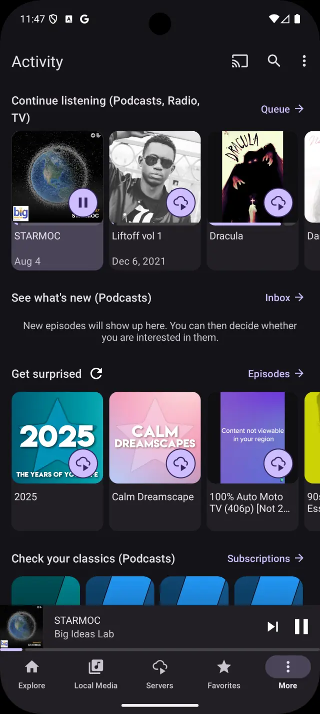

<p align="center">
  
</p>

<h1 align="center">Mediagg — landing page</h1>

<p align="center">
  <a href="https://mediagg.app">mediagg.app</a>
</p>

The marketing site for Mediagg, an Android app that plays the music, podcasts, radio and video
on your phone, on your own media server, and across the web — and casts any of it to Chromecast or
DLNA. Free, no account required.

**This repository holds the website, not the app.** The app is not open source and its source is not
here. The site no longer links APK downloads: it says the app is coming soon to Google Play, and
carries no install link until that listing exists.

## What is here

| Path | |
|---|---|
| `public/` | The site. Eight pages — home, the two edition pages at `/full` and `/personal`, privacy, 404, and three `deeplink/` landing pages Android falls back to when the app is not installed — plus the screenshots and icons. This is what gets deployed. |
| `public/screens/` | Eleven carousel screenshots at 640px, with 1080px twins in `large/` for the enlarged view, plus `hero-choose-style.webp` — the one in the phone at the top of the home page, which is not part of the carousel and so has no twin. |
| `public/icons/` | The two launcher icons, full and personal edition, and `og.png` for link previews. |
| `docs/` | Design sources: After Effects projects, Adobe XD files, marketing renders. Not part of the site. |
| `legacy/` | The retired Jekyll and webpack toolchain. Kept for reference, never built. |
| `_images/`, `icon.png` | Artwork inherited from the original template. Unused by the current pages. |

### The two edition pages

`/full` champions what the full edition adds — the radio, TV and podcast directories — and
`/personal` champions the reason to pick Personal: no ads and nothing tracking what you play, said in
plain terms rather than SDK names. Each takes its accent from its own launcher icon, orange-magenta
against blue-cyan, so which edition you are reading is legible before the words are.

Both end in the same *shared features* section, because the two editions really are the same app
underneath. That block is duplicated in the two files rather than shared at runtime — there is no
build step, and the nav and footer are already duplicated the same way — so **edit it in both files
or not at all.** They are byte-identical today and should stay that way.

## Running it

There is no build step and nothing to install. The pages are plain HTML with their CSS inline, and
the only assets are the screenshots, so any static file server will do:

```
python3 -m http.server -d public 8000
```

Then open http://localhost:8000.

Opening `public/index.html` directly in a browser mostly works, but the pages use root-relative paths
(`/screens/…`, `/privacy`), so the screenshots and the privacy link will not resolve over `file://`.
Serve the directory instead.

## How it deploys

Pushes to `master` that touch `public/**` publish to GitHub Pages through
[`.github/workflows/pages.yml`](.github/workflows/pages.yml). Editing this README or the design
sources in `docs/` does not spend a deploy; the workflow can also be run by hand from the Actions
tab.

The workflow uploads `public/` as a Pages artifact rather than using the "deploy from a branch"
setting, because a branch deploy can only serve the repository root or `/docs`, and the site is in
neither. `public/CNAME` claims `mediagg.app`, and because it travels in the artifact, every deploy
reasserts the custom domain.

`.app` is HSTS-preloaded at the registry level, so the site is HTTPS-only whether it wants to be or
not: there is no HTTP fallback, and a browser that cannot validate the certificate shows an
interstitial the visitor cannot click through.

`netlify.toml` is still present and still correct. Netlify was the original host and publishes the
same `public/` directory with no build command, so it remains a working fallback — but DNS points at
GitHub Pages, so only one of the two is actually serving the domain at any time.

## Credits

Built from [Mobile App Landing Page Template](https://github.com/sandoche/Mobile-app-landingpage-template)
by [Sandoche ADITTANE](https://github.com/sandoche), MIT licensed — see [LICENSE](LICENSE). The
template's Jekyll structure has since been retired to `legacy/` and the pages rewritten, but the
licence and attribution stand.

This repository is a fork of the Mbogi Music site, which is a separate app on a separate account and
is not affected by anything here.
