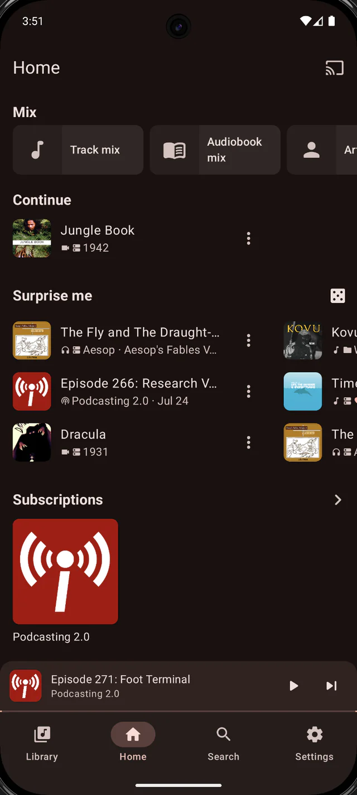

<p align="center">
  
</p>

<h1 align="center">Mediagg — landing page</h1>

<p align="center">
  <a href="https://mediagg.app">mediagg.app</a>
</p>

The marketing site for Mediagg, an app that plays the music, podcasts and video on your phone, on
your own media server, and across the web — and casts any of it to Chromecast or DLNA. Free to use.

**Android is what ships.** The app is a Compose Multiplatform codebase and an iOS build is being
worked towards, which the site says in those words and with no date. `IOS.md` in the app repository
is explicit that no iOS target exists yet, so anything firmer here would be the site promising what
the code does not.

**This repository holds the website, not the app.** The app is not open source and its source is not
here. The site no longer links APK downloads: it says the app is coming soon to Google Play, and
carries no install link until that listing exists.

## What is here

| Path | |
|---|---|
| `public/` | The site. Home, privacy, `m3ugoat/`, 404, three `deeplink/` landing pages Android falls back to when the app is not installed, and two redirect stubs at `/full` and `/personal` — plus the screenshots and icons. This is what gets deployed. |
| `public/screens/` | The fourteen carousel screenshots at 640px, with 1080px twins in `large/` for the enlarged view, plus `hero-home.webp` — the one in the phone at the top of the home page, which is not part of the carousel and so has no twin. All from the shipping build; see below. |
| `public/icons/` | `mediagg.png`, the launcher icon, and `og.png` for link previews. `mediagg-personal.png` is the retired Personal edition's icon, kept but no longer used by any page. |
| `content/` | The documentation sources: Markdown with front matter, plus `_shell.html` and `docs.css`. Edited by hand; never deployed. |
| `scripts/build-docs.py` | Renders `content/documentation/` into `public/documentation/`. Stdlib-only Python, no dependencies. |
| `docs/` | Design sources: After Effects projects, Adobe XD files, marketing renders. **Not part of the site, and not the documentation** — that is `content/` and `public/documentation/`. |
| `legacy/` | The retired Jekyll and webpack toolchain. Kept for reference, never built. |
| `_images/`, `icon.png` | Artwork inherited from the original template. Unused by the current pages. |

### One app, and what the site may say about it

The site used to sell two editions, Mediagg and Mediagg Personal, on two pages that pointed at each
other. **There is one Mediagg now** — the build the app repository calls `freePlayFull` — and the
site describes that and nothing else. `/full` and `/personal` are redirect stubs to `/`: the URLs
were linked from the home page for months, so retiring them with `noindex` and a redirect beats a
404.

Two rules follow from what that build actually is, and both are easy to break by writing nice copy:

- **Only claim what is in it.** It has no Explore screen, no radio or TV directory and no station
  search — those live in the unpublished Xtended build. It does have the podcast charts by country
  and category, reached from Add feed. Media servers, local media, playlists, podcasts, video,
  downloads and casting are all in.
  **This ban is about Explore, not about providers.** `Add from providers` is unconditional — it is
  on the Add subscription screen in `freePlayFull` — so subscribing to a station playlist may be
  described. What may not be described is Explore's tabbed directory and station catalogue, which
  `app/src/full/.../AvailableDestinations.kt` removes from the shipping edition. The documentation
  covers the two providers whose source is the user's own (`Custom Github Directory` and `m3ugoat`)
  and deliberately does not enumerate the catalogues that ship inside the browser.
- **Android Auto and Wear OS are no longer claimed.** The playback service is a
  `MediaLibraryService`, which is what both browse against, but the browse tree it exposes is still
  empty — filling it is Phase 6 in the rewrite. The card that claimed them has been replaced with
  the providers one, which is built.
- **Never describe it by what it lacks.** No "no ads", no "no tracking", no "no analytics" — not as a
  boast, not in a marquee, not in a stat. The absence of advertising is not being sold, and a
  promise made here is one the app has to keep for good. The privacy policy is the exception, and
  only because it must be accurate: it names Crashlytics, which is genuinely in the build, and is
  silent about advertising rather than boasting of its absence.

### The screenshots, and where they come from

**They are from the shipping build.** Every shot on the site was replaced in September 2026 with a
capture of the build the app repository calls `freePlayFull`: the bottom bar reads Library, Home,
Search, Settings, there is no **Explore** tab, and no slide shows a radio station. The eleven
Xtended-build shots that used to be here — Explore tab in the navigation, station search, an Explore
slide — are gone, along with the warning that said not to deploy.

Fourteen carousel slides and the hero, all **dark theme**, because the page is dark. The sources are
landscape mock-up renders, one per screen, each holding the same screen twice — light on the left in
an iPhone frame, dark on the right in an Android one. The site ships the **Android** one, cropped to
the screen alone at `(1250, 37)`–`(2049, 1816)`, which is 799×1779 and the same 2.2266 aspect the
page already used. Two reasons for cropping the frame off: `.frame` in `public/index.html` draws the
bezel itself, and the iPhone shell would promise a build that does not exist.

That crop is 799px wide, so the 1080px twins are upscaled about 1.35×. The enlarged view is capped at
`76vh`/`84vw` and so paints at roughly 500px at most, which the twins still cover at 2× — but a
future capture at 1080px or more of real screen width would be better than this one.

To change the set: drop `.webp` files into `public/screens/` at 640px wide with 1080px twins under
the same names in `public/screens/large/`, then add or remove `<figure class="shot">` blocks in
`public/index.html` to match — the carousel counts its own slides, so the dots, arrows and enlarged
view need no other change. The hero is `hero-home.webp`, is not part of the carousel, and so has no
twin. There is a comment above the rail saying the same thing.

Captions and `alt` describe what is actually on screen, down to the titles, timings and bitrates, so
a caption cannot drift from its picture without someone noticing. Keep that when swapping a shot.

## The m3ugoat page

`/m3ugoat` explains the playlist server the app can subscribe to, and how to add one. Its content is
taken from the provider itself — `providers/m3ugoat/` in the app repository — rather than written
around it, including the reason the app reads that server's API instead of its export link: an m3u
file cannot say which channels are hidden or what order they go in, and an export token is rotatable.

If that provider's `ABOUT` text, its sign-in note or its prompts change, this page should follow.

## The documentation

`/documentation` is fifty pages covering how the app is used. **It is generated**, which is the one
place this repository departs from hand-written HTML — fifty pages could not carry their CSS inline,
and a sidebar copied into every file would mean every new page edited every existing one.

Sources are Markdown with front matter under `content/documentation/`. The directory layout *is* the
navigation: `subscriptions.md` is a section index, `subscriptions/m3ugoat.md` is a page inside it,
and the sidebar, breadcrumbs, section cards and previous/next links are all derived from that. There
is no nav list to maintain.

```
python3 scripts/build-docs.py          # write public/documentation/
python3 scripts/build-docs.py --check  # fail if the committed output is stale
```

**The output is committed**, so the deployed site is still plain static files and the Pages workflow
still just uploads `public/`. The workflow runs `--check` before it deploys, so documentation that no
longer matches its source cannot ship. A build that fails leaves the committed output untouched.

Adding a page is one new file. Front matter takes `title`, `summary`, `order`, `platforms`
(`android`, `ios`, or both — a badge under the title), an `icon` on section indexes only, and
`stub: true` for a page whose scope is written but whose body is not.

The Markdown understood is a deliberately small subset — headings, paragraphs, bold, italic, inline
code, links, lists, tables, blockquotes and fenced code. **Anything else is a hard error**, including
images — the generator has no image support, so the documentation is text even now that the home
page has real screenshots again.

Two content rules on top of the ones above. Quote the app's own wording exactly and in backticks,
checking it against the app source rather than remembering it — the strings are still hard-coded
English in the Compose screens, not in the app's `:i18n` module. And write the platform badge from a
parity sweep (`.claude/skills/parity/parity.sh` in the app repository), never from memory.

## Running it

There is no build step and nothing to install. The pages are plain HTML with their CSS inline, and
the only assets are the screenshots, so any static file server will do:

```
python3 -m http.server -d public 8000
```

Then open http://localhost:8000, or http://localhost:8000/documentation for the documentation. If
you have edited anything under `content/`, run `python3 scripts/build-docs.py` first.

Opening `public/index.html` directly in a browser mostly works, but the pages use root-relative paths
(`/screens/…`, `/privacy`), so the screenshots and the privacy link will not resolve over `file://`.
Serve the directory instead.

## How it deploys

Pushes to `master` that touch `public/**`, `content/**` or `scripts/**` publish to GitHub Pages
through
[`.github/workflows/pages.yml`](.github/workflows/pages.yml). Editing this README or the design
sources in `docs/` does not spend a deploy; the workflow can also be run by hand from the Actions
tab.

The workflow uploads `public/` as a Pages artifact rather than using the "deploy from a branch"
setting, because a branch deploy can only serve the repository root or `/docs`, and the site is in
neither. `public/CNAME` claims `mediagg.app`, and because it travels in the artifact, every deploy
reasserts the custom domain.

`.app` is HSTS-preloaded at the registry level, so the site is HTTPS-only whether it wants to be or
not: there is no HTTP fallback, and a browser that cannot validate the certificate shows an
interstitial the visitor cannot click through.

`netlify.toml` is still present and still correct. Netlify was the original host and publishes the
same `public/` directory with no build command, so it remains a working fallback — but DNS points at
GitHub Pages, so only one of the two is actually serving the domain at any time.

## Credits

Built from [Mobile App Landing Page Template](https://github.com/sandoche/Mobile-app-landingpage-template)
by [Sandoche ADITTANE](https://github.com/sandoche), MIT licensed — see [LICENSE](LICENSE). The
template's Jekyll structure has since been retired to `legacy/` and the pages rewritten, but the
licence and attribution stand.

This repository is a fork of the Mbogi Music site, which is a separate app on a separate account and
is not affected by anything here.
