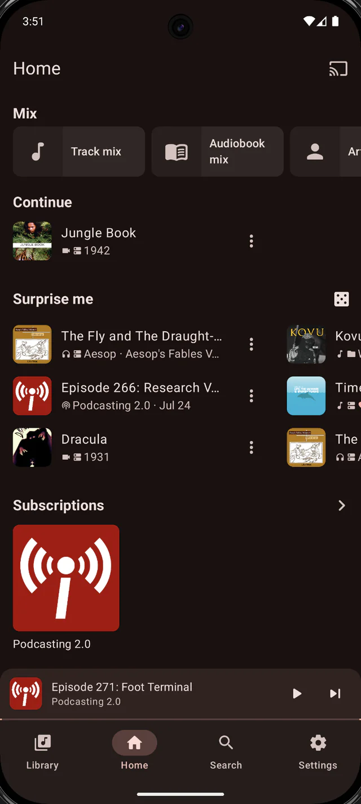

<p align="center">
  
</p>

<h1 align="center">Mediagg — landing page</h1>

<p align="center">
  <a href="https://mediagg.app">mediagg.app</a>
</p>

The marketing site for Mediagg, an app that plays the music, podcasts and video on your phone, on
your own media server, and across the web — and casts any of it to Chromecast or DLNA. Free to use.

**Android is what ships.** The app is a Compose Multiplatform codebase. An iOS app exists — it
builds and runs on an iPhone — but it is not on the App Store, so the site calls it on the way, with
no date, and never tells anyone they can install it. Anything firmer would be the site promising a
listing that does not exist.

**This repository holds the website, not the app.** The app is not open source and its source is not
here. The site no longer links APK downloads: it says the app is coming soon to Google Play, and
carries no install link until that listing is public. The listing, `app.mediagg`, is in closed
testing; it is a new listing, not the old `com.mbogimusic` one.

## What is here

| Path | |
|---|---|
| `public/` | The site. Home, privacy, `m3ugoat/`, 404, three `deeplink/` pages for links the old app generated (the current app has no `/deeplink/` intent filter, so these links always land here, and the pages say so), and two redirect stubs at `/full` and `/personal` — plus the screenshots and icons. This is what gets deployed. |
| `public/screens/` | The fourteen carousel screenshots at 1119px, with full-size 2238px twins in `large/` for the enlarged view, plus `hero-home.webp` — the one at the top of the home page, which is not part of the carousel and so has no twin. Landscape renders, two phones each, from the shipping build; see below. |
| `public/icons/` | `mediagg.png`, the launcher icon, and `og.png` for link previews. `mediagg-personal.png` is the retired Personal edition's icon, kept but no longer used by any page. |
| `content/` | The documentation sources: Markdown with front matter, plus `_shell.html` and `docs.css`. Edited by hand; never deployed. |
| `scripts/build-docs.py` | Renders `content/documentation/` into `public/documentation/`. Stdlib-only Python, no dependencies. |
| `docs/` | Design sources: After Effects projects, Adobe XD files, marketing renders. **Not part of the site, and not the documentation** — that is `content/` and `public/documentation/`. |
| `legacy/` | The retired Jekyll and webpack toolchain. Kept for reference, never built. |
| `_images/`, `icon.png` | Artwork inherited from the original template. Unused by the current pages. |

### One app, and what the site may say about it

**Mediagg is a new app.** It is the Compose Multiplatform rewrite in `mediagg-kmp`, shipped on Play
as the `playFull` build under `app.mediagg`. The site describes that app and nothing else: not the
old Mediagg, not its Personal edition, not Mbogi Music. `/full` and `/personal` are redirect stubs
to `/`, kept only because the old URLs were linked for months.

One rule, and it is easy to break by writing nice copy:

- **Only claim what is in it, checked against the `mediagg-kmp` source.** Not against the old
  app, not against the `:i18n` strings (inherited from the old app, mostly unused), and not from
  memory. As of September 2026 that means, among other things:
  - no Explore screen or station directory (`app/src/full/.../AvailableDestinations.kt` removes it);
  - `Add from providers` offers `Custom Github Directory` and `m3ugoat` only: the radio and IPTV
    catalogues are commented out in `di/.../StreamProviderModules.kt`;
  - no Android Auto or Wear OS, because the `MediaLibraryService` browse tree is empty;
  - no home-screen widgets, no OPML export, no skip silence (the column exists, no player reads it).

  When one of those ships, the site may say so.

**Saying what the app does not do is fine when it is true.** It has no ads SDK, no analytics and no
crash reporter (crash logs stay on the device, and `Report an issue` opens a GitHub issue the user
submits), so the site and the privacy policy may say that plainly. The privacy policy lists what the
app does send and to whom, and changes in the same breath as the app does: if an ads, analytics or
crash-reporting SDK is ever added, every such statement on the site goes with it.

### The screenshots, and where they come from

**They are from the shipping build.** Every shot on the site was replaced in September 2026 with a
capture of the build the app repository calls `playFull`: the bottom bar reads Library, Home,
Search, Settings, there is no **Explore** tab, and no slide shows a radio station. The eleven
Xtended-build shots that used to be here — Explore tab in the navigation, station search, an Explore
slide — are gone, along with the warning that said not to deploy.

Fourteen carousel slides and the hero. The sources are **landscape mock-up renders** — one picture
per screen, each holding the same screen twice: an iPhone in the light theme on the left, an Android
phone in the dark on the right. The renders came on a grey background; that has been **cut away to
transparency**, so each picture is the two devices and nothing else. The source PNGs in
`../mediagg_screenshots/` are the cut-out versions, and the untouched renders are kept alongside in
`../mediagg_screenshots_originals/`. Nothing else is cropped out of them, so every slide shows both
platforms and both themes at once. They are 2238×1854; the carousel gets an exact half at 1119×927
and the enlarged view gets the full size, so **nothing is upscaled**. The WebPs keep the alpha
channel, so re-encode with transparency if you regenerate them.

Two layout consequences, both already handled, and both easy to undo by accident:

- **Nothing here draws a bezel or a card.** `.frame`, the hero's `.shotcard` and the enlarged
  view's `.lbshell` have no border, background or box-shadow — the pictures are transparent around
  the phones, so any of those would draw a rectangle round two phone shapes. The hero and the
  enlarged view put a `drop-shadow` filter on the image instead, which follows the phones' outline.
  The carousel has none: headless Chrome did not paint the slides with one.
- **`.shot` sets `margin:16px 0`.** A `<figure>` carries `margin: 1em 40px` by default, which padded
  the rail's 26px gap out to 106px. That looked deliberate behind 236px portrait slides; behind a
  520px landscape slide it is the difference between two fitting across the rail and one, and one
  per page gives the carousel a dot per slide.

The hero's floating cards moved out to 1% and 11% for the same reason: a landscape render is more
than twice the width of the portrait phone that used to stand there, and cards at 22% would sit on
top of it. `.stage` heights are per breakpoint, each keeping the render's ~74px overhang into the
marquee.

**iOS is in every picture, and the copy must not follow it there.** The renders show an iPhone
because that is how they were supplied and what was asked for. The iOS app runs but is not
published — see the top of this file — so the page says "Android now · iOS on the way" in the hero eyebrow and nowhere
claims you can install it on an iPhone today. The screenshots section is headed "Real screens, both
themes", not anything about iOS, and that wording is load-bearing: it is also why it no longer says
"no mock-ups", which these renders plainly are.

To change the set: drop `.webp` files into `public/screens/` at 1119px wide with 2238px twins under
the same names in `public/screens/large/`, then add or remove `<figure class="shot">` blocks in
`public/index.html` to match — the carousel counts its own slides, so the dots, arrows and enlarged
view need no other change. The hero is `hero-home.webp`, is not part of the carousel, and so has no
twin. There is a comment above the rail saying the same thing.

Captions and `alt` describe what is actually on screen, down to the titles, timings and bitrates, so
a caption cannot drift from its picture without someone noticing. Keep that when swapping a shot.

The other nineteen renders in the set — `arrange_navbar`, `library`, `queue`, `podcast`,
`podcast_synchronization`, `subscriptions`, `subscriptions_episodes`, `media_servers_manage`,
`media_servers_filter`, `media_servers_home_audiobookshelf`, `player_2`, `player_more_details`,
`search_2`, `media_server_albums`, `media_server_combined`, `media_server_combined_2`,
`media_servers_home_jellyfin_2` and `player_video_fullscreen` — are not on the site. They are not
rejects; there was no slot. `player_video_fullscreen` is the one that could not be used as-is: its
phones are landscape, so it does not share the others' shape.

## The m3ugoat page

`/m3ugoat` explains the playlist server the app can subscribe to, and how to add one. Its content is
taken from the provider itself — `providers/m3ugoat/` in the app repository — rather than written
around it, including the reason the app reads that server's API instead of its export link: an m3u
file cannot say which channels are hidden or what order they go in, and an export token is rotatable.

If that provider's `ABOUT` text, its sign-in note or its prompts change, this page should follow.

## The documentation

`/documentation` is fifty pages covering how the app is used. **It is generated**, which is the one
place this repository departs from hand-written HTML — fifty pages could not carry their CSS inline,
and a sidebar copied into every file would mean every new page edited every existing one.

Sources are Markdown with front matter under `content/documentation/`. The directory layout *is* the
navigation: `subscriptions.md` is a section index, `subscriptions/m3ugoat.md` is a page inside it,
and the sidebar, breadcrumbs, section cards and previous/next links are all derived from that. There
is no nav list to maintain.

```
python3 scripts/build-docs.py          # write public/documentation/
python3 scripts/build-docs.py --check  # fail if the committed output is stale
```

**The output is committed**, so the deployed site is still plain static files and the Pages workflow
still just uploads `public/`. The workflow runs `--check` before it deploys, so documentation that no
longer matches its source cannot ship. A build that fails leaves the committed output untouched.

Adding a page is one new file. Front matter takes `title`, `summary`, `order`, `platforms`
(`android`, `ios`, or both — a badge under the title), an `icon` on section indexes only, and
`stub: true` for a page whose scope is written but whose body is not.

The Markdown understood is a deliberately small subset — headings, paragraphs, bold, italic, inline
code, links, lists, tables, blockquotes and fenced code. **Anything else is a hard error**, including
images — the generator has no image support, so the documentation is text even now that the home
page has real screenshots again.

Two content rules on top of the ones above. Quote the app's own wording exactly and in backticks,
checking it against the app source rather than remembering it — the strings are still hard-coded
English in the Compose screens, not in the app's `:i18n` module. And write the platform badge from a
parity sweep (`.claude/skills/parity/parity.sh` in the app repository), never from memory.

## Running it

There is no build step and nothing to install. The pages are plain HTML with their CSS inline, and
the only assets are the screenshots, so any static file server will do:

```
python3 -m http.server -d public 8000
```

Then open http://localhost:8000, or http://localhost:8000/documentation for the documentation. If
you have edited anything under `content/`, run `python3 scripts/build-docs.py` first.

Opening `public/index.html` directly in a browser mostly works, but the pages use root-relative paths
(`/screens/…`, `/privacy`), so the screenshots and the privacy link will not resolve over `file://`.
Serve the directory instead.

## How it deploys

Pushes to `master` that touch `public/**`, `content/**` or `scripts/**` publish to GitHub Pages
through
[`.github/workflows/pages.yml`](.github/workflows/pages.yml). Editing this README or the design
sources in `docs/` does not spend a deploy; the workflow can also be run by hand from the Actions
tab.

The workflow uploads `public/` as a Pages artifact rather than using the "deploy from a branch"
setting, because a branch deploy can only serve the repository root or `/docs`, and the site is in
neither. `public/CNAME` claims `mediagg.app`, and because it travels in the artifact, every deploy
reasserts the custom domain.

`.app` is HSTS-preloaded at the registry level, so the site is HTTPS-only whether it wants to be or
not: there is no HTTP fallback, and a browser that cannot validate the certificate shows an
interstitial the visitor cannot click through.

`netlify.toml` is still present and still correct. Netlify was the original host and publishes the
same `public/` directory with no build command, so it remains a working fallback — but DNS points at
GitHub Pages, so only one of the two is actually serving the domain at any time.

## Credits

Built from [Mobile App Landing Page Template](https://github.com/sandoche/Mobile-app-landingpage-template)
by [Sandoche ADITTANE](https://github.com/sandoche), MIT licensed — see [LICENSE](LICENSE). The
template's Jekyll structure has since been retired to `legacy/` and the pages rewritten, but the
licence and attribution stand.

This repository started as a fork of an unrelated app's site. Nothing here describes that app.
